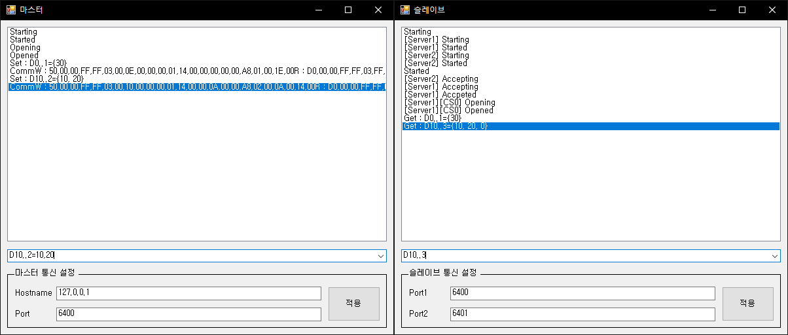

# MCProtocol

Melsec MCProtocol Library

Support frames are MC3E, MC4E

Selectable Binary, Ascii

## MCProtocol.Test

Protocol Test Project

Select mode 'Master' or 'Slave'

## Master

client, connect to slave

configure slave's hostname, portnumber

command can query to server get, set variable

## Slave

server, like Melsec PLC

has two tcplistener

configure each portnumber

command can get, set variable own memory

## Command

### Get Command

Get variable from slave, or own memory

* {DeviceCode}{Addess}
* {DeviceCode}{Addess}..{Count}

Example

* D0 // Get D0 variable
* D0..2 // Get D0, D1 variable

### Set Command

Set variable to slave, or own memory

* {DeviceCode}{Addess}={Value}
* {DeviceCode}{Addess}..{Count}={Value0},{Value1},{Value2}....{Value n}

Example

* D100=30 // Set D100 to 30
* D0..2=1,2 // Set D0=1, D1=2

